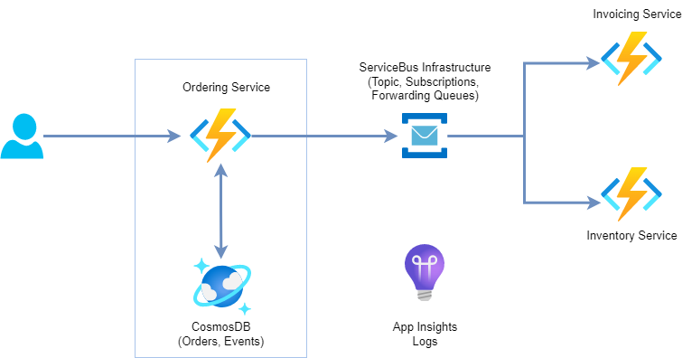
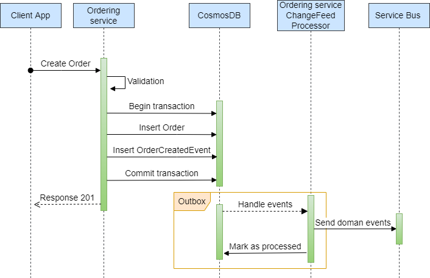

# Transactional Outbox Pattern with Azure Cosmos DB and Azure Functions

Sometimes a service needs to update a database and sends an event,  ex. service needs to update an aggregate and publishes a domain event automatically. If something goes wrong after updating a database, a domain event will not be published. That can be challenging because Message Broker cannot implement 2FC transactions.
This example is a simple implementation of the Transactional Outbox pattern which solves a problem with reliable messaging in distributed systems. `Azure Cosmos DB` is used for the database and `Azure Functions` as a service host.

## Services

There are three microservices:
* `Ordering service` which exposes REST API for creating Order, and publishes domain events,
* `Inventory service` which listens for Order domain events,
* `Invoicing service` which listens for Order domain events.
  
 

###
Ordering Service

The Ordering Service is responsible process Order requests. When Order is created it is stored in the Cosmos DB. There is a Cosmos DB change feed handler that is triggered each time the Cosmos database is updated. Service exposes two endpoints:
* POST `/api/order`
  
  payload:
  ``` json
    {
        "OrderDetail" : "{order details}",
        "CustomerFirstName" : "{customer first name}",
        "CustomerLastName" : "{customer last name}",
        "CustomerAddress" : "{customer address}",
        "PaymentAmount" : {amount},
        "PaymentType" : "{payment type}",
        "Description" : "{description}"
    }
  ```

* GET `/api/health`

The microservice implementation is a combination of domain-driven design (DDD) and the mediator pattern (MediatR package) with the command and query responsibility segregation (CQRS) pattern. It is implemented as an Isolated Azure Functions with tree function triggers in a single function host:
* CreateOrderApi - HTTP trigger function,
* HealthCheckApi - HTTP trigger function,
* EventHandler - Cosmos DB trigger function with Service Bus output binding.

 


## Cloud Infrastructure
Cloud infrastructure is provisioning through code instead of through manual processes (IaC - Infrastructure as Code) using `Terraform`. It is in the terraform folder.
Commands for deployment: `az login`, `terraform init`, `terraform plan`, `terraform apply`.

## Local Debugging
Set user secrets for:
#### Ordering Service
```json
{
  "CosmosDbConnectionString": "{cosmosdb connection string}",
  "CosmosDbDatabaseName": "{cosmosdb database name}",
  "CosmosDbContainerName": "{cosmosdb container name}",
  "CosmosDbLeasesContainerName": "{cosmosdb lease database name}",
  "ServiceBusConnectionString": "{service bus connection string}",
  "ServiceBusTopicName": "{service bus topic name for order events}"
}
```
#### Inventory service
```json
{
  "ServiceBusConnectionString": "{service bus connection string}",
  "ServiceBusigOrderCreatedQueueName": "{service bus queue name for order events}"
}
````

#### Invoicing service
```json
{
  "ServiceBusConnectionString": "{service bus connection string}",
  "ServiceBusigOrderCreatedQueueName": "{service bus queue name for order events}"
}
````